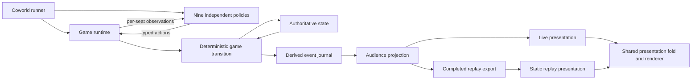

# Who Cried Wolf Coworld System and Protocol Design

Status: technical design for Tasks 2–5, ready for team reconciliation before production implementation. Product constraints, the eight-day draw rule, replay export boundary, root package layout, and blocked-nomination kill resolution are accepted; other detailed technical choices below are recommendations for that reconciliation.

**Outcome:** Nine independently replaceable policies finish a bounded social-deduction episode whose public conversation and approved post-game reveal replay through the same presentation code.

Governing records: [product contract](../product/v1-contract.md), [architecture record](../architecture/architecture-record.md). This document owns precise protocol and data-flow recommendations; it is not an implementation acceptance report. [Engineering Manager](agent:engineering-manager-4) reconciles it with runtime, rules-parity, and spectator work.

## 1. Architecture and alternatives

Use one authoritative game process, one policy process per Coworld slot, and one browser presentation application. Keep TypeScript modules in one root package with one `package-lock.json`; Node runs game and policies, while a static browser build uses only contracts and presentation modules. Pin runtime/dependencies when implementing, using the in-tree Coworld Node example as packaging evidence rather than importing it.



| Approach | Benefit | Cost / decision |
| --- | --- | --- |
| Game state plus derived evidence; separate policies | One judge, policy substitution, shared event-based presentation | Recommended; strict audience boundary required |
| Central benchmark showrunner | Reuses provider orchestration quickly | Declined: player pods become ceremonial; prompts and private information centralized |
| Full Tofu runtime or event-sourced game plus browser judge | More source parity or replay resimulation | Declined: hosting coupling or unnecessary recovery machinery; duplicates responsibilities |

The game transition returns `{state, events}`. Runtime commits the state and corresponding in-memory journal append in one serialized critical section before broadcasting anything. Only it can accept an action, close a window, apply a fallback, resolve a vote, kill a player, or finish the game. The journal describes those decisions. It is never folded back into live game state. A presentation fold only reconstructs what a viewer should see, never legal moves or scoring.

State contains roles/alive status, phase/day, pending requests and accepted choices, secret seed/random counters, private knowledge, speech counters, and current result. Visible transcript context comes from the journal; do not also keep a mutable transcript in state. Small counters used by the floor controller are game-owned bookkeeping. One bounded process/journal is enough; no database, bus, independent projector service, or crash-resume protocol. Process loss fails the episode rather than guessing recovery.

## 2. Concrete module and file boundaries

These are proposed files, not files implemented by this design. Use these ownership boundaries even if engineering adjusts filenames during reconciliation.

| Path | Responsibility and allowed dependencies |
| --- | --- |
| `src/shared/player.ts` | Observation/action/control validators and derived types; no game or provider imports |
| `src/shared/events.ts` | Event payload unions, audience and reveal taxonomy |
| `src/shared/replay.ts` | Replay/results validation; no DOM or game mechanics |
| `src/game/domain/state.ts` | Authoritative state, roles, pending request state |
| `src/game/domain/transition.ts` | Pure command-to-state/events transition |
| `src/game/domain/rules.ts` | Target legality, day/night resolution, victory and day cap |
| `src/game/domain/random.ts` | Versioned seed discipline and labeled random draws |
| `src/game/domain/floor.ts` | Deterministic public bid ranking and speech budgets |
| `src/game/runtime/session.ts` | Serialized dispatcher, timers, connections, request closure, journal |
| `src/game/runtime/server.ts` | Required Coworld HTTP/WS endpoints and startup/shutdown |
| `src/game/runtime/artifacts.ts` | Config URI reads, atomic file writes, HTTP artifact writes |
| `src/game/runtime/export.ts` | Terminal allowlist export, results from terminal state |
| `src/player/main.ts` | Slot connection, reconnect, deadlines, clean exit |
| `src/player/scripted.ts` | Deterministic legal no-model baseline using only observations |
| `src/player/show.ts` | Bounded personality/context prompt and strict response mapping |
| `src/player/bedrock.ts` | Model-specific InvokeModel adapter, bounded retry, safe error codes |
| `src/shared/presentation/project.ts` | Pure audience filtering; used server-side before serialization |
| `src/shared/presentation/fold.ts` | Pure presentation reconstruction from projected events |
| `src/viewer/live.ts` | WS delivery/reset adapter only |
| `src/viewer/replay.ts` | Replay fetch, validation, clock, seek, loop adapter only |
| `src/viewer/App.tsx` | Shared player/global/replay renderer; never imports game state/domain |
| `tests/{domain,protocol,privacy,replay,runtime}/` | Focused behavior fixtures and integration evidence |
| `coworld_manifest.template.json`, `compose.yaml`, `Dockerfile` (game/player targets) | Package boundary; only game and player required |
| `tools/build_replay_viewer.sh` | Clean build into its absolute output argument; no publish |

The Manager accepted this root-package layout on 2026-09-15: no workspace packages, one lockfile, and one Dockerfile with game/player targets. The Designer owns component names and renderer details; the viewer files here indicate dependency seams only.

Recommend one contracts validator definition per shape, with types/schema artifacts derived during implementation. Do not maintain independent hand-coded validators in game, player, and browser. Protocol documentation can link this design until a generated public protocol page exists; any later split must replace the governing pointer here.

No package depends on Tofu/Nakama/Discord/FanForge/analytics, benchmark server/SQLite, or the local Coworld Python installation at runtime. Adapt selected functions with attribution and independent boundary tests. Keep the game image free of provider SDKs and the player image free of game internals. Share contract files through normal root-package builds, not filesystem mounts into other pods. Asset reuse requires a per-asset source/license record; otherwise use original placeholders.

## 3. Game lifecycle, rules seam, and time budget

### Accepted rules envelope

Slots are integers 0–8; identities never depend on display names or provider/model names. Assign exactly Wolf, Alchemist, Seer, Guard, and five Sheep. Wolf and Alchemist form the Wolf faction; other roles are Town. Faction win means 1 for every member of that faction, including dead seats, and 0 for the other faction. At the configurable day cap (default `maxDays=8`), check normal victory first; if neither faction has won, finish as a draw with nine zero scores. This terminal rule was accepted by the Manager on 2026-09-15.

The rules-parity specification owns detailed Tofu mechanics after reconciliation. Source evidence requires explicit treatment of majority/abstention, seeded Wolf kill ties, Alchemist's kill plus block, Seer death-before-investigation, no self-targeting, and death secrecy. Do not silently substitute benchmark plurality voting or doctor self-protection. Pending protocol drafts allow the server to enumerate exact legal targets/abilities; none of these choices requires clients to implement rules.

### Settled Seer result delivery

The Manager's revised decision on 2026-09-15 supersedes the earlier killed-Seer private `no_result` instruction. If the Seer is dead when inspection would resolve, compute no alignment, emit no live `private_result`, and send no new dead-seat update. Record only server-audience `night_outcome` with `{ability:'inspect', actor:<seer>, target:<attempted target>, outcome:'actor_dead'}`, revealable after completion under `night_choices`. The replay fold may explain this evidence as “no result—the Seer died before resolution”; it must not synthesize a delivered `private_result`.

If the Seer is alive but blocked, emit bare `PrivateResult.result='no_result'` only to that seat, without a causal field, and retain `night_outcome(..., outcome:'blocked')` for server/postgame reveal. Check death before the blocked branch when both apply. No new control message or dead-seat exception is introduced.

### Bounded orchestration recommendation

A cycle is day discussion, simultaneous vote, day resolution/victory check, night Wolf discussion, simultaneous night actions, night resolution/victory check. Day 1 begins with discussion, matching current Tofu production behavior; older first-night tests are stale. A phase boundary commits all simultaneous choices in slot order, not network arrival order. The Manager accepted this night adaptation on 2026-09-15: resolve blocks first, remove blocked actors' kill nominations, tally remaining living Wolf/Alchemist nominations, and select among sorted tied targets using labeled seeded randomness. No valid nomination means no kill. There is no last-arriving execution actor. Guard protection then applies to the selected attack; Seer results follow deaths. This replaces Tofu's transport-sensitive last-voter execution rule.

| Budget | Standard preset | Effect |
| --- | ---: | --- |
| Player connection wait | 180 s maximum | Start on all connected or deadline; runner may fail startup first |
| Public discussion windows/day | 6 × 8 s | All living policies bid concurrently; at most one speech/window |
| Vote window/day | 8 s | All living policies vote concurrently; reveal at close |
| Wolf chat/night | 4 × 8 s | Two turns each for up to two living Wolves, sequential |
| Night action window | 8 s | Every living policy receives one composite action request |
| Cycles | 8 default | Terminal draw if needed |
| Finish/artifact budget | 30 s | End notification then complete artifacts and shutdown |

Default game-owned upper bound is `180 + 8*(48+8+32+8) + 30 = 978 seconds`, below the documented 1,200-second hosted Job deadline. This leaves 222 seconds for pod scheduling and overhead; it does not guarantee infrastructure startup. Validate configured budgets at startup: positive integers, `1 <= maxDays <= 8` for the standard hosted preset, and the same formula <=978 s. A larger day cap is allowed only with correspondingly smaller window budgets preserving that bound; cap schema range at 32 to bound artifact size. Exact config shape/defaults are in §8. Use one named fast certification preset with identical mechanics and shorter windows. Runtime cannot enlarge a deadline when retrying or reconnecting.

Public night lasts its full configured 40 seconds, even if no or only one policy has a private action to take. Keep absent Wolf chat turns idle and do not publish private subphase progress, participant counts, per-seat night readiness, or response latency. All living seats get the composite night request at the same public-relative time, including Sheep with no active abilities. Public bid/vote windows may also use fixed closure for reproducible pacing. Simulated timers make baseline verification fast without changing domain rules.

At a game-owned deadline, use legal fallbacks and continue. At the day cap, draw. If the process cannot advance or write artifacts within bounds, exit as a runtime failure; do not relabel a runtime failure as a game draw. No game guarantee covers a dead pod, unavailable storage, or an expired platform Job.

### Randomness and reproducibility

A concrete config may supply a 128-bit seed as 32 lowercase hex digits for tests. Otherwise the game obtains a fresh seed from the operating system. Never send the seed, PRNG state, token list, hidden-state hash, or raw config to players/global viewers. A public fixed tournament seed would reveal the role shuffle. Certification may use a known seed in a clearly noncompetitive fixture.

Use a versioned random helper with separate labels for role assignment and night ties. Recommended portable algorithm: SHA-256 of UTF-8 `seed + ':' + label + ':' + counter`; take the first unsigned 32 bits big-endian, rejection-sample into the requested range, increment counter on every attempt. Role assignment uses Fisher–Yates over the fixed role list above, slots ascending. Sorting inputs before drawing makes ordering explicit. Never use `Math.random`, wall time, arrival order, or names for rule randomness.

Same version, seed, normalized action/timeout trace gives the same domain result. Seed alone cannot reproduce LLM content or network timeouts. Replay playback reproduces recorded presentation without rerunning policies or mechanics. Record the seed only in the completed replay reveal, not live logs. A hash of low-entropy hidden state is also unsafe to expose.

## 4. Player wire protocol: `wcw.player/1`

The following TypeScript-shaped notation specifies JSON data, not production code. Every object is closed (`additionalProperties: false`), every field required unless marked `?`, every integer finite and within its stated range. No coercion, duplicate object keys, unknown union tags, non-JSON numbers, or extra nested fields. Reject unsupported versions. No legacy benchmark snake/camel aliases. The transport is text JSON over the authenticated `/player` WebSocket.

### Primitive and shared shapes

```typescript
type Slot = 0 | 1 | 2 | 3 | 4 | 5 | 6 | 7 | 8;
type Role = 'wolf' | 'alchemist' | 'seer' | 'guard' | 'sheep';
type Faction = 'wolf' | 'town';
type Phase = 'waiting' | 'day' | 'vote' | 'night' | 'finished';
type Ability = 'kill' | 'block' | 'inspect' | 'protect';
type Code = 'timeout' | 'disconnected' | 'malformed' | 'illegal'
  | 'refused' | 'provider_error' | 'throttled' | 'version';
type PublicSeat = { slot: Slot; name: string; alive: boolean };
type Choice = { ability: Ability; targets: Slot[]; allowPass: true };
type PrivateResult = {
  day: number; ability: 'inspect'; target: Slot;
  result: 'wolf' | 'not_wolf' | 'no_result';
};
type VoteRow = { slot: Slot; target: Slot | null };
```

Names are 1–80 Unicode code points and are escaped as plain text; duplicates are valid. Days are integers 0–32 (0 only in waiting). IDs are opaque game-issued strings of 1–80 ASCII alphanumeric/`_-` characters. Text is bounded by Unicode code points and encoded byte limits, with NUL and control characters other than newline rejected. Action message <=8 KiB UTF-8; speech <=480 characters; authored `summary`/`reason` <=240 characters. Entire observation <=512 KiB; runtime retains up to 128 most recent permitted speech events per observation, plus complete structured public vote history and private result ledger. Journal and replay have separate bounded limits below.

### Observation and request

```typescript
type Request =
  | { kind: 'bid'; window: number; maxCharacters: 480 }
  | { kind: 'wolf_chat'; turn: number; maxCharacters: 480 }
  | { kind: 'vote'; targets: Slot[]; allowPass: true }
  | { kind: 'night'; choices: Choice[] };
type Observation = {
  protocol: 'wcw.player/1'; type: 'observation'; episodeId: string;
  observationId: string; requestId: string; attempt: 0 | 1;
  remainingMs: number; phase: Phase; day: number;
  self: { slot: Slot; role: Role; faction: Faction; alive: boolean };
  roster: PublicSeat[];
  teammates: { slot: Slot; role: 'wolf' | 'alchemist' }[];
  privateResults: PrivateResult[];
  votes: { day: number; ballots: VoteRow[]; eliminated: Slot | null }[];
  transcript: ProjectedEvent[];
  transcriptTruncated: boolean;
  request: Request;
};
```

`roster` has exactly nine rows in slot order. `teammates` is empty for Town; Wolves receive both faction identities (including self and later-dead teammates) from their initial knowledge. Only living seats receive action observations. Death grants no new private knowledge and ends action requests. `privateResults` contains only the authenticated seat's permitted inspection results; a killed-before-resolution inspection contributes no new result entry. No generic roles map is present. Own ability outcomes are restricted by the rules spec; the observation does not expose omniscient block/protection/kill success reasons.

`observationId` and `requestId` use independent per-seat counters/opaque IDs, never private global journal indices. One outstanding request per seat. The observation is a complete bounded snapshot; reconnect does not require delta catch-up or a second state authority. `remainingMs` is a nonnegative integer measured from a monotonic game deadline when sending, not client wall time. The game owns the deadline even if the client ignores it. Retry uses the same request and observation IDs, fresh remaining budget, and `attempt=1`. Limits and lists are authority granted to this request; the server still checks legality against its stored phase snapshot.

### Action

```typescript
type Bid = {
  kind: 'bid'; wantsToSpeak: boolean; urgency: 0 | 1 | 2 | 3;
  text: string; replyTo: string | null; accusation: Slot | null;
  reason: string;
};
type ActionBody = Bid
  | { kind: 'wolf_chat'; text: string; summary: string }
  | { kind: 'vote'; target: Slot | null; summary: string }
  | { kind: 'night'; actions: { ability: Ability; target: Slot | null }[];
      summary: string };
type Action = {
  protocol: 'wcw.player/1'; type: 'action'; episodeId: string;
  requestId: string; observationId: string;
  body: ActionBody;
  report: null | { code: 'refused' | 'provider_error' | 'throttled'; attempts: 0 | 1 | 2 };
};
```

No submitted slot, role, audience, phase, score, model identity, or event ID can override server authority. Bind identity to the authenticated socket. `body.kind` must equal the outstanding request kind. `wantsToSpeak=false` requires empty text, null reply/accusation, and zero urgency; reason may explain a deliberate pass. An offered bid needs nonempty text. `replyTo` references a visible public speech ID, never a private/global journal ID. Accusation is optional declared speech metadata, not a truth claim inferred by an LLM or regex.

Vote targets must occur in `request.targets`, or be null (abstain). Night response has exactly one row per offered ability, same order, no duplicate abilities; an empty list is Sheep's legal pass. Each target is from that ability's list or null. Alchemist returns kill and block in one response; one omitted/illegal row invalidates the composite response, not a silent partial acceptance. A summary is an explicit post-game game-facing explanation and never public vote speech. Wolf chat's `text` is delivered to the permitted living team at the turn boundary, while its `summary` remains seat-private until replay export.

For all requests, empty summaries are legal; an empty Wolf chat text is a deliberate pass. `bid.reason` is stored only with the private bid and can be rendered as an authored summary; do not duplicate it as a second transcript authority.

A policy report is self-reported evidence, not proof of a provider failure. Validate a legal body even when `report` is present, then record the safe code. A policy refusing a choice supplies the legal fallback body. Do not accept raw error strings, stacks, provider response objects, or hidden reasoning fields.

### Server control messages and connection ownership

```typescript
type Control =
  | { protocol: 'wcw.player/1'; type: 'ready'; episodeId: string; slot: Slot }
  | { protocol: 'wcw.player/1'; type: 'receipt'; requestId: string;
      status: 'accepted' | 'duplicate' | 'rejected' | 'expired';
      code: Code | null; retry: boolean }
  | { protocol: 'wcw.player/1'; type: 'end'; episodeId: string;
      result: Results };
```

Handshake: authenticate exact token for slot before upgrade, send `ready`, then current observation if actionable. Reject bad token/slot with HTTP 401/403; never log query strings. One controlling policy socket per slot: a second live control connection is rejected; after disconnect, reauthenticate and resend the same outstanding request if time remains. One replacement action cannot undo an accepted action. Cache accepted body and receipt for the current request; identical retransmission is a duplicate receipt, altered retransmission is rejected. Expired/foreign IDs cannot mutate state. No new timeout or retry budget on reconnect.

`/client/player?slot&token` is a read-only seat inspector for v1, not a second controller. Its browser opens `/player?slot&token&mode=inspect`; this game-owned optional query mode receives snapshots/events but never action authority and cannot replace the policy connection. Require authentication for both HTML and WS. Inspector traffic never exposes tokens in referrers: set a no-referrer policy and load only bundled local assets. Before assignment it receives ready/waiting viewer packets. After assignment it receives the following full seat view on authorized updates:

```typescript
type Inspection = {
  protocol: 'wcw.player/1'; type: 'inspection'; episodeId: string;
  slot: Slot;
  view: Pick<Observation, 'self' | 'roster' | 'teammates' | 'privateResults'
    | 'votes' | 'transcript' | 'transcriptTruncated' | 'phase' | 'day'>;
};
```

The same bounded snapshot constraints apply; dead inspectors retain their authorized prior knowledge plus public updates. No ready/start/human control button. On completion, send `end` to all connected policies, allow up to 2 seconds for clean client shutdown, close sockets, then finalize artifacts and exit. Bundled clients handle end/normal close idempotently and exit 0.

## 5. Request validation, deterministic floor, and failure handling

For each request: schema-decode -> match episode/request/observation -> verify socket/phase eligibility -> validate kind and targets -> store one normalized action. Close a window on its monotonic deadline and apply accepted choices/fallbacks in ascending slot order. Buffer per-request diagnostic facts and append them at window closure in slot order (first rejection, then final disposition). Receipts are immediate transport messages and do not consume journal sequence. Server event sequence is independent of arrival order for the same normalized response/failure trace. Send receipts promptly, but do not broadcast private acceptance progress. Duplicate/invalid frames cannot generate unlimited journal entries: retain at most the first rejection plus final outcome per request; close a connection after 16 unsolicited/invalid frames in one window. Per-connection inbound limit is 8 KiB/frame; disable payload logging.

On first invalid response, issue one typed rejection and repeat the same observation with `attempt=1` within the original deadline. On second invalid response or timeout, choose fallback. Unsupported protocol closes that policy connection with a safe version error and uses fallbacks. A disconnected seat costs no repeated request wait; its fallback is known immediately, while public phase timing remains fixed. A reconnected seat is eligible only for subsequent unfilled requests within their original deadlines.

| Request | Deterministic fallback | Diagnostic |
| --- | --- | --- |
| Bid | Decline, empty text/metadata | Safe reason code; no fabricated strategic silence |
| Wolf chat | Empty text/summary | No generated speech attributed to the model |
| Vote | Null target | Abstention, separate failure code |
| Night | Null for every offered ability | No-op choices; separate failure code |

A legal voluntary pass is distinct from a server fallback and from a self-reported provider fallback. The `failure` event records provenance. The game does not emit Coworld `GamePlayerFailure` for these recoverable cases. Infrastructure errors, missing pods, artifact IO failures, and a hung game remain runner/runtime failures.

Public bids collect concurrently; select at most one valid nonempty bid per window. Rank using only public evidence: ascending speech count this day, then valid direct reply to the last public speech, then urgency descending, then rotating seat priority `(slot - ((day-1+window) % 9) + 9) % 9` ascending. A seat may speak at most twice/day. Exclude exact repeats of its own last five public messages after trim/lowercase normalization. Record rank and selection, not a claim that lexical keywords measure strategic quality. Commit the winning text directly; a second generation call would add latency and permit changing an accepted bid. Other proposed text remains private until approved export. A deterministic narrator uses phase/result templates; no model host is required.

Wolf conversation is two rounds in ascending living Wolf slot order. Each response is committed before the next request is built. Fill remaining allotted turns with silence; do not use natural-language “plan locked” detection to control rules. Confessionals ride in action summaries; they do not add model requests or timers. Policy-level prompts may use the benchmark's personality, win condition, visible roster/history, urgency, concise speech, and private ledgers, but none of its omniscient state object or raw production logs.

Bundled Bedrock policy: read `BEDROCK_MODEL`; hosted endpoint comes from `AWS_ENDPOINT_URL_BEDROCK_RUNTIME`, use InvokeModel. Distinguish local direct credentials from hosted sidecar configuration. At most two provider attempts within an 8-second request, reserving 500 ms for serialization/send; cap each attempt by remaining request budget and disable independent SDK retry multiplication. Retry transient throttle/transport errors once only if budget remains, honoring retry-after within that budget. Authentication/config errors do not retry. Validate model output locally into this exact wire shape; no permissive JSON repair in the game. On exhaustion submit a legal action and typed report. Missing hosted sidecar is a configuration/infrastructure finding, not evidence of model strategy. Keep model selection, personality, and provider in policy configuration.

## 6. Event schema and audience enforcement: `wcw.events/1`

### Internal journal envelope

```typescript
type Audience = { kind: 'public' } | { kind: 'seats'; slots: Slot[] }
  | { kind: 'server' };
type Reveal = 'public' | 'roles' | 'wolf_chat' | 'confessional'
  | 'night_choices' | 'discarded_bids' | 'failures' | 'never';
type Event = {
  schema: 'wcw.events/1'; seq: number; day: number; phase: Phase;
  audience: Audience; reveal: Reveal; payload: Payload;
};
type Speech = {
  slot: Slot; text: string; replyTo: string | null; accusation: Slot | null;
};
type Payload =
  | { kind: 'started'; roster: PublicSeat[]; rulesVersion: string }
  | { kind: 'phase'; phase: Phase; day: number; durationMs: number }
  | { kind: 'speech'; speech: Speech }
  | { kind: 'wolf_chat'; slot: Slot; text: string }
  | { kind: 'confessional'; slot: Slot; requestKind: 'bid' | 'wolf_chat' | 'vote' | 'night'; text: string }
  | { kind: 'bid'; slot: Slot; window: number; bid: Bid;
      rank: number | null; selected: boolean }
  | { kind: 'ballots'; ballots: VoteRow[]; eliminated: Slot | null;
      resolution: 'majority' | 'no_majority' | 'tie' | 'all_abstain' }
  | { kind: 'night_choices'; slot: Slot;
      actions: { ability: Ability; target: Slot | null }[] }
  | { kind: 'night_outcome'; ability: Ability; actor: Slot | null; target: Slot | null;
      outcome: 'applied' | 'blocked' | 'protected' | 'passed' | 'actor_dead' }
  | { kind: 'private_result'; slot: Slot; result: PrivateResult }
  | { kind: 'elimination'; slot: Slot; cause: 'vote' | 'wolf' }
  | { kind: 'night_resolved'; eliminated: Slot[] }
  | { kind: 'failure'; slot: Slot; requestKind: 'bid' | 'wolf_chat' | 'vote' | 'night';
      code: Code; source: 'game' | 'policy_report'; disposition: 'retry' | 'fallback';
      attempt: 0 | 1 | 2 }
  | { kind: 'finished'; result: Results }
  | { kind: 'roles'; roles: { slot: Slot; role: Role; faction: Faction }[] }
  | { kind: 'seed'; seed: string; randomVersion: 'sha256-counter/1' };
```

`night_outcome.actor` is null only for the faction kill; individual abilities require their actor slot. The kill outcome describes the chosen faction attack, not a last-voter executor.

`seq` is internal, contiguous, starts at 1, and never goes to a live client. Day/phase encode public chronology only; Wolf turn detail stays inside private payload. All text has the limits from §4; `rulesVersion` <=80 ASCII characters, counters nonnegative integers within configured windows, arrays <=9 except bounded histories. All events must validate their kind/audience/reveal combination against the table below, not merely fit the union. Slots are unique and sorted where representing a set. Every event is built from normalized state/actions; never spread a model object into an event.

Store at most 20,000 events and 32 MiB of serialized journal/replay data under validated configuration; worst-case normal bounds must fit these limits. Unsolicited traffic cannot fill the journal. If an internal bug exceeds the bound, fail export visibly rather than silently truncate a supposedly complete replay. Observe/configure limits before accepting an episode; do not change game behavior mid-episode to hide memory growth.

### Required audience/reveal matrix

| Event | Live audience | Completed replay category |
| --- | --- | --- |
| Started, public phase, accepted public speech, ballots at vote close, elimination, night resolved, finished | Public | public |
| Bid including proposed text/rank/selection | Originating seat | discarded_bids |
| Authored confession/reason | Originating seat | confessional |
| Wolf speech | Living Wolf seats at emission | wolf_chat |
| Submitted night choices | Acting seat; faction kill sharing only if rules explicitly permit | night_choices |
| Private Seer result (only if living at inspection resolution) | Acting seat | night_choices |
| Omniscient night resolution detail | Server | night_choices |
| Failure/retry/fallback diagnostic | Acting seat | failures |
| Roles and seed | Server | roles |

Emit separate payloads where audiences differ. Public accepted speech must not include the bid reason or failure code. Public ballots reveal choices after all votes close, never their private summaries or which policies have answered. Night summary reveals eliminated slots only; no attack targets saved by protection, hidden blocker identity, or number of acting roles. The full outcome detail is server-only until export. A policy can voluntarily claim a role in public speech; the renderer must label speech as a claim and never promote it to authoritative role metadata.

Resolve `Audience.seats` to concrete authorized slots at emission. Do not store a dynamic `wolf` group and recompute membership during replay/reconnect. Dead players keep already-known facts but gain no private chats/results solely because they died. Death does not grant access to a global omniscient endpoint. Public global stream remains public after finish; full reveal is a separate completed replay artifact, avoiding accidental audience upgrades on an existing connection.

### Projected event and spectator protocol

```typescript
type ProjectedEvent = {
  schema: 'wcw.events/1'; id: string; cursor: number;
  day: number; phase: Phase; reveal: Exclude<Reveal, 'never'>;
  payload: Payload;
};
type ViewerPacket = {
  protocol: 'wcw.viewer/1'; type: 'reset' | 'events'; episodeId: string;
  throughCursor: number; events: ProjectedEvent[];
};
```

Projection first authorizes the event and allowlists payload fields, then assigns a recipient-local cursor (starting at 1) and opaque ID. No placeholders, private sequence gaps, server audience lists, secret request IDs, timing stamps, or hidden-state versions survive. References (`replyTo`) use stable public speech IDs assigned on publication; use a distinct public ID namespace independent of private event emission. Replay export preserves those public IDs and assigns its own contiguous cursors for additional reveal events. `throughCursor` is the last included cursor or 0 for an empty stream.

`/global` immediately sends a `reset` packet, including an empty/waiting representation before start; later packets are incremental `events`. Reconnect gets a full bounded reset from the projected journal, not an application-level resume negotiation. Inspector data uses the authenticated seat projection and same presentation fold. Action observations carry only the bounded recent permitted transcript subset, in original cursor order, with truncation explicitly signaled. A viewer may see multiple packets; cursor duplicates are ignored and a gap triggers reconnect/reset. Heartbeats/ping contain no hidden progress metadata.

Both live and replay call the same `project`/`fold` functions. The server calls projection before serialization; the static viewer can filter exported reveal categories for spoiler preferences only. When applying an event, the presentation fold updates roster/status, phase, speech timeline, accusations, public ballots, outcome, and revealed panels. It never resolves a vote or infers a hidden role. A reset begins from the empty presentation state and folds its ordered events. Viewer controls do not send game commands.

## 7. Replay and result schema

```typescript
type Results = {
  schema: 'wcw.results/1'; rulesVersion: string;
  outcome: 'town_win' | 'wolf_win' | 'draw';
  reason: 'wolves_eliminated' | 'wolf_parity' | 'day_cap';
  daysCompleted: number; scores: number[];
};
type Replay = {
  schema: 'wcw.replay/1'; eventSchema: 'wcw.events/1';
  gameVersion: string; rulesVersion: string; complete: true;
  episodeId: string; maxDays: number;
  revealPolicy: 'postgame_allowlist/1';
  events: ProjectedEvent[]; result: Results;
};
```

Scores are exactly nine integers, each 0 or 1, in slot order. Outcome/reason pairs are fixed by the union semantics: town win/wolves eliminated, wolf win/wolf parity, draw/day cap. `daysCompleted` counts fully resolved nights; a Day 1 win therefore has 0 completed days, while a draw at the default cap has 8. All outcome fields agree with terminal state and the `finished` event. Results contain no seed, tokens, provider diagnostics, or raw text. Validate these cross-field constraints as well as shape. Platforms read `scores`; richer behavior metrics are optional future diagnostics with no score influence.

Export only after terminal resolution. Whitelist the six private reveal categories plus public events explicitly, construct fresh payload objects, and reject `never`/unknown kinds. The `roles` event has nine role/faction rows; the seed event is exported only now. `complete:true` is set only after validation, including exactly one started and finished event, increasing cursors, valid references, unique slots, and a valid terminal result. Never put raw state/config or arbitrary journal internals into replay bytes. JSON is sufficient; no database dump, compressed custom binary format, or WASM game engine is needed.

The browser reads `?replay=`, fetches opaque bytes with a 32 MiB decoded limit, validates exact supported versions and all references, and shows visible loading/parse/version errors. Use relative bundle asset URLs and plain escaped text (no HTML/Markdown execution, remote embeds, or clickable model-supplied URLs). No model calls occur during replay. Start automatically, pause/seek/speed work, and loop from end to start by default. Seek refolds from the beginning at v1's bounded size; add derived checkpoints only if measured performance warrants them. Public-only replay uses the same subset/order as captured live delivery; any playback-clock metadata is presentation-only and cannot change game outcomes.

Assign deterministic playback durations by event kind rather than exposing private runtime timestamps: speech 4 s, public phase 1 s, ballots/elimination/night summary 2 s, finished 4 s, private reveal panels/bids 0 s (attached to their phase). The Designer may tune these values as presentation configuration; they are not rules. At seek position, show only events up to that cursor plus explicitly chosen post-game reveal mode; distinguish “known then” from “revealed after completion.” The reveal toggle is never a security claim over downloaded bytes.

### Publication and shutdown order

1. Resolve terminal state and append terminal evidence; build and validate result/replay in memory.
2. Send end messages to policies, allow bounded clean exit, and close sockets.
3. Write full replay then results, using local temporary siblings plus atomic rename for file URIs; success requires both. For HTTP destinations use the requested method with bounded timeout and verify success status. Do not append/trickle a completed artifact.
4. Exit game process 0 only after both writes succeed; surface write failure and exit nonzero otherwise. Coworld owns final infrastructure/error artifacts. No crash recovery or cross-destination transaction is promised.

An HTTP POST is not assumed idempotent: on ambiguous failure do not retry blindly or fabricate success. No need for a custom durable outbox; artifacts are bounded episode outputs and the runner owns the job boundary.

## 8. Coworld deployment and platform gaps

The game-owned concrete config uses this closed shape; validate supplied fields first, then apply defaults and validate the normalized budget, with standard timing values from §3. Authored config schemas require tokens for the runner contract, while authored fixture/config documents omit only that injected field.

```typescript
type GameConfig = {
  tokens: string[]; players: { name: string }[];
  seed?: string; maxDays?: number;
  player_connect_timeout_seconds?: number;
  windowMs?: number;
};
```

Tokens are nine nonempty, distinct opaque strings, used only for auth. Players are nine names (the §4 limits apply). Seed is 32 lowercase hex digits when supplied. `maxDays` defaults to 8, integer 1–32; `player_connect_timeout_seconds` defaults to 180, integer 1–180; `windowMs` defaults to 8000, integer 100–8000. All six public, four private, vote, and action windows use this duration. Validate `connectSeconds + maxDays * 12 * windowMs / 1000 + 30 <= 978`; illegal config fails before readiness. A fast fixture can set `windowMs=100` with the same deterministic scripted policies. These config fields are game-owned, not additions to Coworld's manifest model.

Use the current manifest schema to author one game and at least one bundled player, tags (at least three), at least one variant, public docs/protocol references, config/results schemas, and a nine-seat certification fixture. Omit a commissioner and optional roles unless a separate accepted need exists. Do not author `game.version` in the build template; let the build hydrate it. Game config has required `tokens:string[9]`, declared `players:{name:string}[9]`, seed optional, and bounded time/day settings. Authored variants/certification configs omit tokens; runner injects them. `certification.players` explicitly seats nine runnable references; every declared baseline runnable must run. Include a no-model scripted player; keep the show player free of external provider calls in certification via an explicitly named mock mode, with real Bedrock proof a separate rung.

`COGAME_HOST`/`COGAME_PORT` (defaults `0.0.0.0:8080`) own bind address. Read config from `COGAME_CONFIG_URI`, write to `COGAME_RESULTS_URI` and `COGAME_SAVE_REPLAY_URI`. Support file/plain-path and HTTP(S) reads/writes following Paint Arena's boundary helper; honor `COGAME_RESULTS_METHOD` and `COGAME_SAVE_REPLAY_METHOD`, PUT default or POST. Current hosted runner uses shared file paths and uploads from its worker; do not invent direct AWS storage credentials or SDK plumbing in the game.

Required routes: `/healthz`, `/client/player`, `/player?slot&token`, `/client/global`, `/global`. Answer WebSocket Ping with identical Pong payload, including while waiting. Static replay is the chosen supported replay contract: manifest `game.replay_viewer.bundle: "replay-viewer"` resolves beside the hydrated manifest (`dist/replay-viewer` for `dist/coworld_manifest.json`). The executable build hook receives that absolute directory, deletes stale output safely, rebuilds from checked-in sources/locks, and emits `index.html` plus relative assets. The directory is generated/gitignored; never point at source root or preserve old files. Do not enable optional replay gzip until the loader supports magic-byte detection and decoded size limits.

| Verified limitation | Required response |
| --- | --- |
| Hosted game-only public lobby is unsupported | Use local `coworld play` and completed hosted episode replay; no custom lobby/auth layer |
| Static bundle skips legacy replay probes in certification | Independently open the static bundle with produced replay in a real browser |
| Current `play --replay` and `run-episode --verify-replay` still probe container replay paths | Use standalone static HTTP viewer evidence; do not claim these flags work for static-only v1 |
| Local episode runner requires game and every policy to exit successfully | A crashing/nonzero/hanging policy may fail CLI even when legal game artifacts exist; distinguish game reliability from runner acceptance |
| Hosted startup/deadline failures belong to runner | Game fallbacks cannot guarantee episode success when pods cannot start or storage fails |
| Replay bytes publicly served after completion | Export only approved reveal fields; spoiler controls cannot secure downloaded data |
| Game/player stdout and optional policy artifacts can be exposed by platform | Bundled code must not print hidden state, prompts, raw provider content, tokens, or URL queries; third-party policy logging is outside game enforcement |

No compatibility layer is added for legacy replay CLI behavior. If local replay commands become a requirement, surface the gap to Coworld maintainers or add only a thin container route serving the exact same compiled static viewer and parser under a separately accepted task. Likewise do not add hosted producer controls.

## 9. Verification strategy and next implementation slices

These are required implementation evidence, not checks this documentation task claims to have run. Builders own implementation and behavioral verification; the Architect owns the architectural recommendation.

| Surface | Focused evidence |
| --- | --- |
| Domain | Exact nine roles; legal target lists; strict majority/abstain; blocking/protection/kill/inspection order; seeded ties; death/no new knowledge; win after each resolution; Night 8 draw |
| Determinism | Same seed plus normalized action/timeout trace gives identical state/results; permute network arrival and confirm batch outcomes unchanged |
| Protocol | Strict shape/size/version; every action union; wrong slot/token/request/phase; one bounded retry; duplicate vs changed resend; composite night legality |
| Reliability | Missing client, late action, malformed frames, provider refusal/throttle, reconnect, invalid flood all reach legal fallback within unchanged budgets |
| Privacy | Sentinel secrets in every private field; inspect raw `/global`, seat snapshots, logs, replay bytes; vary hidden roles/actions and assert equal permitted projections except allowed effects |
| Timing privacy | Night duration, public cursors, waiting packets, and alive-seat request cadence do not reveal private actor count/response timing |
| Seer death | Killed before inspection: no private_result or dead-seat update; server actor_dead exports postgame. Living blocked Seer: private bare no_result, causal blocked evidence server/replay only |
| Reveal | Export excludes credentials/prompts/raw reasoning/diagnostics/unknown payloads; role reveal only in completed artifact; dead seat gets no privileged stream |
| Replay parity | Capture live public events; export/reload/fold public subset; assert identical presentation at each public cursor and final score; no policy or domain execution in viewer |
| Browser | Static-only HTTP server and CORS replay; autoplay/pause/seek/speed/loop, resize, unknown/corrupt/missing/oversized replay visibly fail; no remote dependency |
| Runtime | Ready/waiting snapshots, invalid token rejection, read-only inspector, RFC Ping/Pong, fresh hidden seed, URI file/HTTP method behavior, artifacts last and clean exit |
| Packaging | Clean build removes sentinel; hydrated bundle relative path valid; nine fixture policies and every declared runnable launches; schemas validate |
| Platform | `coworld build`, headless episode, `coworld play`, `coworld certify`, then separately authorized publish and hosted experience; inspect results/replay/logs at every rung |

Implementation slicing recommendation:

1. Contracts plus deterministic domain and scripted policy; verify an in-process nine-seat trace and cap draw with adversarial failures.
2. Coworld server/URI adapter and separate game/player images; headless episode with legal artifacts and clean processes. Inspect raw audience output before adding UI.
3. Shared presentation fold/live/static replay bundle; parity fixtures and real browser proof. Prove the artifact allowlist before shipping reveal controls.
4. Show policy with typed provider adapter, mock provider fixtures, bounded retry and explicit failure reports; substitute it without changing the game image. Real credential/hosted checks require the appropriate authority.

Suggested eventual scripts are `test:domain`, `test:protocol`, `test:privacy`, `test:replay`, `test:runtime`, and `build`; builders should add and document them rather than assume they exist today. This repository currently has no executable application or configured Markdown linter. For this docs-only change run `git diff --check`, local Markdown link/heading/fence checks, and review every table/schema for consistency. A doc pass cannot prove runtime correctness.

## 10. Evidence and remaining reconciliation

Source repositories were read only. Commit IDs identify their HEAD at inspection; local working-tree content was the immediate evidence and may include uncommitted changes. Recheck relevant sources before implementation if they move.

| Source | Revision and exact evidence |
| --- | --- |
| Accepted product | `mt-port` initial `53c4ce043c46b9e6d3e1bbdb4a33dd5b49273af4`, amended by `dc81a2d21bc03bd33ea1723674abda1f4dca6f83` (day cap/export); `docs/product/v1-contract.md` |
| Coworld | `6506e676533caab80c9688e877d57355100e98af`; `src/coworld/docs/roles/GAME.md`, `roles/PLAYER.md`, `BEDROCK.md`, `STATIC_REPLAY_VIEWERS.md`, `AUTHORING.md`, `LIFECYCLE.md`, `artifacts/RESULTS.md`; `examples/paintarena/game/server.py` |
| Tofu | `bd90913c4b506eda1985c78a4a5f85191a8158c5`; `apps/@hotpot-arcade/packages/games/mafia/src/server/machine/mafia-state-machine.ts`, `handlers/{day-handler,night-handler,utilities,check-game-over}.ts`, `server/match-machine-helpers/state-sync.ts`, `shared/types/player-roles.ts` |
| Benchmark | `efc993dd9beb762628acf6c3e9a3cb32198b2a06`; `packages/engine/src/llm/openRouterProtocol.ts`, `domain/floorController.ts`, `orchestration/runners.ts` |

Repository roots: `/Users/jt/projects/coworld`, `/Users/jt/projects/tofu-tech`, `/Users/jt/projects/mafia-who-cried-wolf-benchmark`. Source citations above are local evidence, not remote interface promises. Coworld role/schema contracts prevail over example drift. Runtime reconnaissance from [Coworld Principal Engineer](agent:mt-port-principal-engineer) additionally inspected `bundle.py:87`, `play.py:309`, `runner/runner.py:499`, and hosted runner documentation for output-parent bundle resolution and process/replay probe distinctions.

The assessment's “one event log source of truth” wording is superseded by one game authority plus derived evidence. The benchmark's permissive JSON salvage, name-based targets, provider raw-response records, centralized model calls, and unbounded provider time do not carry over. Tofu's wall-clock last-kill-voter behavior is replaced by the accepted nomination tally; mutable vote timing requires the explicit final-response adaptation in the rules spec. These deviations are intentional recommendations, not accidental claims of full parity.

Remaining work before implementation design acceptance: verify final rules and viewer handbacks use the settled immutable-response, floor-ranking, two-round Wolf-chat, and revised Seer-death semantics, then attach their canonical committed records. The eight-day draw, export allowlist, root package layout, and blocked-actor nomination tally are settled. No schema migration/legacy client support is needed for this new game. Hosted live theater, credential use, publishing, and deployment remain outside this documentation assignment.
